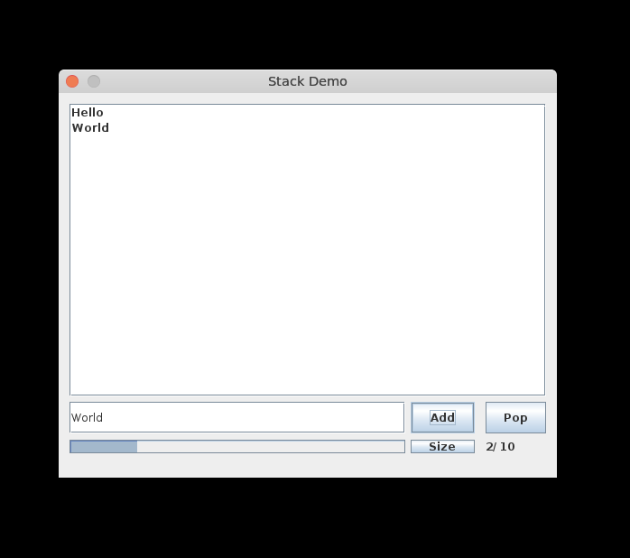
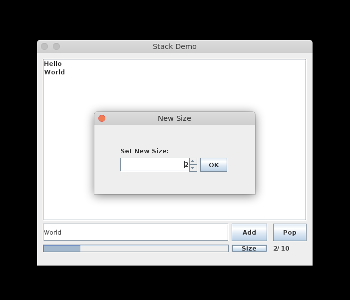

# JStack Demo
A Basic Java Application for demonstrating the implementation of the stack data structure

## Note:
-Java Development Kit (JDK) or Java Runtime Environment (JRE) is required

-For Linux or MacOS Users, To run the project from the command line, go to the dist folder and
type the following:
'''
	java -jar "dist/JStackDemo.jar"
'''

## Screenshots:

